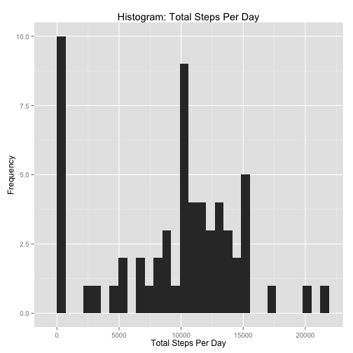
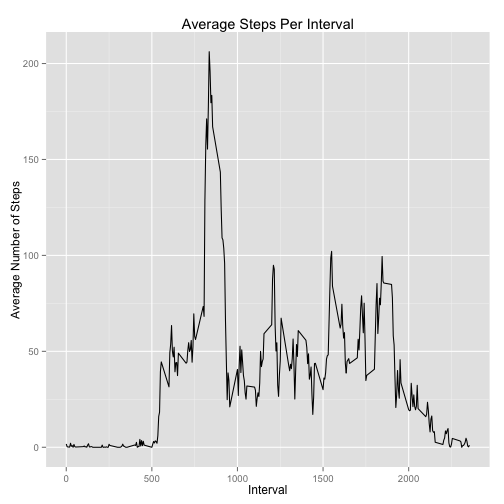
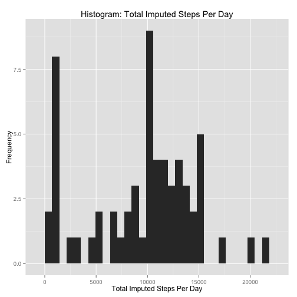
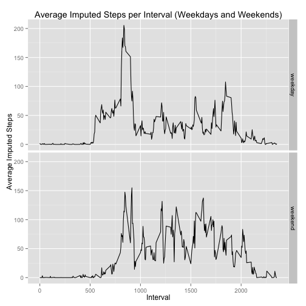

# Reproducible Research: Peer Assessment 1
## Requirements
We need the following packages for this processing.

```r
require(dplyr)
require(ggplot2)
```

## Loading and preprocessing the data
The data is loaded into a data frame tbl for processing.

```r
csv_file <- unz(description = "activity.zip", filename = "activity.csv")
activity_data <- tbl_df(read.csv(csv_file))
```

## What is the mean total number of steps taken per day?
The total number of steps per day is given by grouping by date and summing,
excluding missing values.

```r
summaries_per_day <- activity_data %>%
        group_by(date) %>%
        summarise(total_steps = sum(steps, na.rm=TRUE))
```

Plot a histogram, showing the count of the total steps per day.
We use the default of 30 bins.

```r
ggplot(summaries_per_day) + 
        aes(x = total_steps) + 
        geom_histogram(data = summaries_per_day) +
        ggtitle("Histogram: Total Steps Per Day") + 
        xlab("Total Steps Per Day") +
        ylab("Frequency")
```

```
## stat_bin: binwidth defaulted to range/30. Use 'binwidth = x' to adjust this.
```

 

Get the mean and median of the total steps per day.

```r
summaries = data_frame(mean_total_steps_per_day <- 
                               mean(summaries_per_day$total_steps, na.rm = TRUE))
summaries$median_total_steps_per_day <- 
        median(summaries_per_day$total_steps, na.rm = TRUE)
```

The mean total steps per day:

```
## [1] 9354.23
```

The median total steps per day: 

```
## [1] 10395
```

## What is the average daily activity pattern?
We make a plot of the average steps per interval by taking the mean of the steps
over the days, then we plot this.

```r
summaries_per_interval <- activity_data %>%
        group_by(interval) %>%
        summarise(average_steps = mean(steps, na.rm=TRUE))

ggplot(summaries_per_interval) +
	aes(x = interval, y = average_steps) +
	geom_line() +
        ggtitle("Average Steps Per Interval") + 
        xlab("Interval") +
        ylab("Average Number of Steps")
```

 

We find the five minute interval with the highest average steps.

```r
summaries$max_average_steps <- summaries_per_interval %>%
        filter(average_steps == max(average_steps))
```

The interval with the highest average steps is:

```
## [1] 835
```

## Imputing missing values
Here, we impute the missing values.
First, we determine how many steps are missing.

```r
summaries$na_steps_count <- summarise(activity_data, total_na_steps = sum(is.na(steps)))
```
The number of missing steps is:

```
## [1] 2304
```

We use median steps of the corresponding interval to impute values.

First, calculate the median steps per interval by getting the median over dates.

```r
summaries_per_interval$median_steps <- (
        activity_data %>% 
        group_by(interval) %>%
	summarise(median_steps = median(steps, na.rm = TRUE))
)$median_steps
```

Here we split the data into days, replace missing steps with associated median 
for that interval, and recombine.

Note: we rely on the fact that the data per day is already sorted by interval.
If it wasn't, we would use arrange here too.

```r
activity_data <- activity_data %>%
	      mutate(isna = is.na(steps)) %>%
	      group_by(date) %>%
	      mutate(imputed_steps = ifelse(
	              is.na(steps),
	              summaries_per_interval$median_steps, 
	              steps))
```

Now that we have the imputed data, lets calculate the total steps per day by
totalling over intervals and plot it.

```r
summaries_per_day$total_imputed_steps <- (activity_data %>%
        group_by(date) %>%
        summarise(total_imputed_steps = sum(imputed_steps)))$total_imputed_steps

ggplot(summaries_per_day) + 
        aes(x = total_imputed_steps) + 
        geom_histogram(data = per_day) +
        ggtitle("Histogram: Total Imputed Steps Per Day") + 
        xlab("Total Imputed Steps Per Day") +
        ylab("Frequency")
```

```
## stat_bin: binwidth defaulted to range/30. Use 'binwidth = x' to adjust this.
```

 

What is the mean and median of total imputed steps?

```r
summaries$mean_total_imputed_steps <- 
        mean(summaries_per_day$total_imputed_steps)
summaries$median_total_imputed_steps <- 
        median(summaries_per_day$total_imputed_steps)
```

The mean is:

```
## [1] 9503.869
```

The median is:

```
## [1] 10395
```

We see that the mean is slightly higher, but the median has not changed. 
Why is this?

The mean is slightly higher because the imputed values have increased the totals
slightly.

The median has not changed because the 50th percentile in the totals is unchanged
and the number of totals is not changed.

## Are there differences in activity patterns between weekdays and weekends?
Add a weekend/weekday factor

```r
activity_data <- activity_data %>%
        mutate(day_type = ifelse(
                weekdays(as.Date(date)) %in% c("Sunday", "Saturday"),
                "weekend", 
                "weekday"
                )) %>%
        mutate(day_type = factor(day_type, levels = c("weekday", "weekend")))

summaries_per_interval_per_day_type <- activity_data %>%
        group_by(interval, day_type) %>%
        summarise(average_imputed_steps = mean(imputed_steps))
```

Create our panel plot of the number of steps taken per interval, averaged over
days and faceted by weekend and weekdays.

```r
ggplot(data = summaries_per_interval_per_day_type) +
        facet_grid(day_type ~ .) +
        aes(x = interval, y = average_imputed_steps) +
        geom_line() +
        ggtitle("Average Imputed Steps per Interval (Weekdays and Weekends)") + 
        xlab("Interval") +
        ylab("Average Imputed Steps")
```

 
